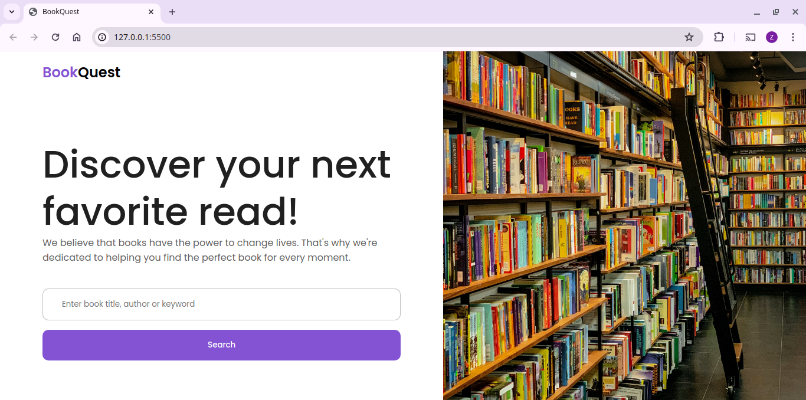

# BookQuest

This is my JavaScript project for Moringa School.

## Overview

This project involved building a book-search single-page application (SPA). It fetches data from OpenLibrary API. 

## The Challenge

1. As a user I can search for a book using the title, author or a keyword
2. As a user I can sort my search results by relevance, descending rating and ascending rating
3. As a user I can filter my search results by publication year

## Preview

Built with:
  HTML
  CSS
  JavaScript